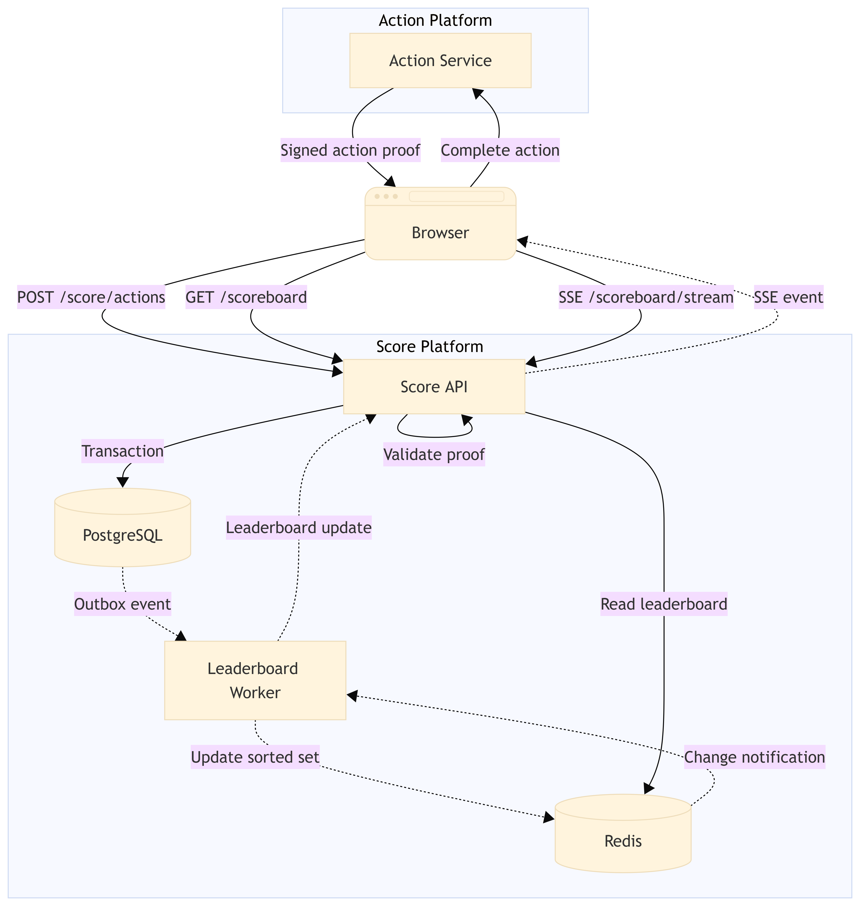
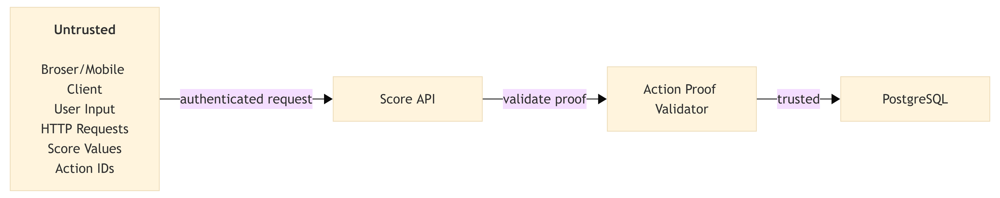
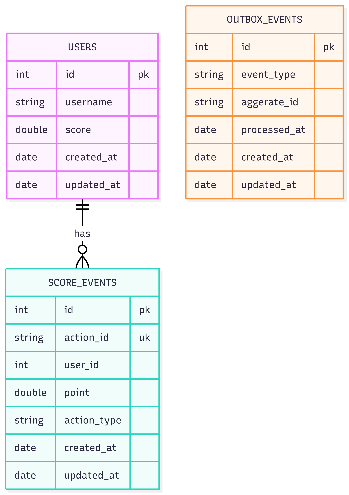
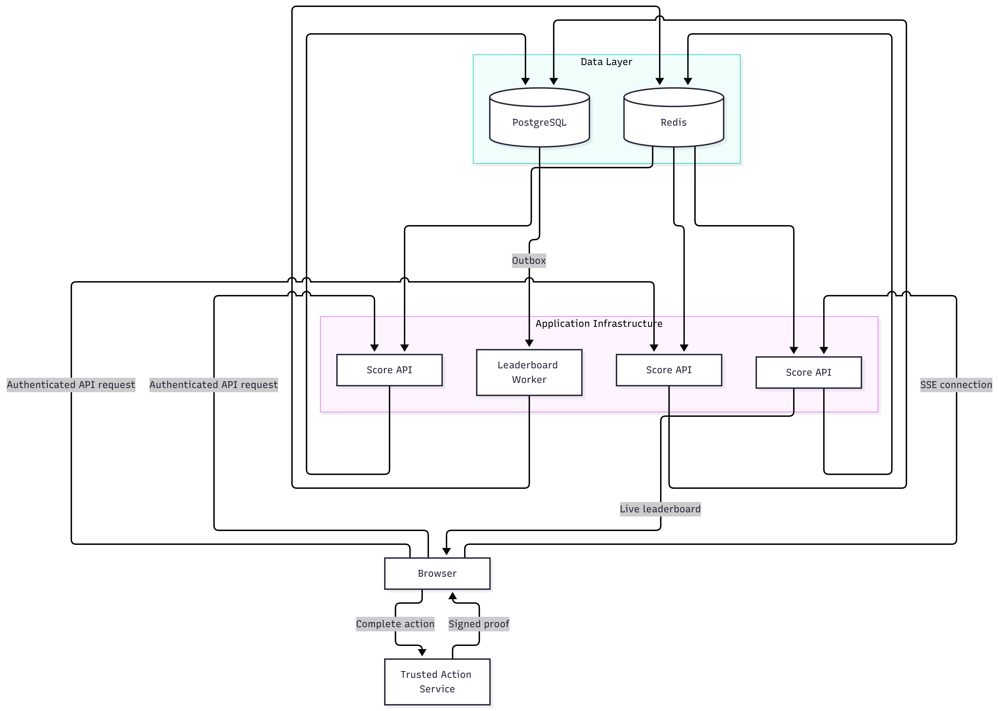

# Problem 6 — Scoreboard API Specification
## 1. Overview
This document specifies the backend module responsible for maintaining and broadcasting a real-time user scoreboard.

The system must:
- Maintain user scores.
- Display the top 10 users.
- Update the scoreboard in real time.
- Allow an authenticated user action to increase their score.
- Prevent clients from arbitrarily increasing their score.
- Handle duplicate requests safely.
- Remain correct when multiple score updates happen concurrently.

### Core Principle
    The client must never be trusted to determine the score increment

The API should receive a server-generated, one-time proof that the action was legitimately completed.

## 2. Requirements
### Functional Requirement
The functional requirements that must be included are:
- <b>Scoreboard,</b> the system must expose the current top 10 users ordered by score.
- <b>Score update,</b> the system must expose the current top 10 users ordered by score. The action itself is outside the scope of this module.
- <b>Live update,</b> connected clients must receive leaderboard changes without polling.
- <b>Authorization,</b> only authenticated users with a valid action proof may increase their score.
- <b>Idempotency,</b> only authenticated users with a valid action proof may increase their score.

## 3. High-Level Architecture


## 4. Trust Boundaries
The most important part of this system is defining what can and cannot be trusted. Client must <b>never</b> sent:
```json
{
  "score": 1000000
}
```
or
```json
{
  "points": 1000
}
```
and expect the server to trust it. Instead, the client sends and action proof.


## 5. Action Authorization
Use a server-generated, short-lived, signed action proof. For example, the Action Service generates:
```json
{
  "actionId": "01JXYZ...",
  "userId": "user-123",
  "points": 10,
  "actionType": "COMPLETE_ACTION",
  "issuedAt": 1791340000,
  "expiresAt": 1791340060
}
```
The payload is cryptographically signed by the trusted Action Service. 

The client forwards this proof to the Score API. 

The Score API verifies:
1. Signature.
2. Issuer.
3. Audience.
4. User identity.
5. Action type.
6. Expiration.
7. Action ID uniqueness.

Only then should the score be changed.

### Important
The browser may see the number of points, but it must not be able to modify the number of points.

For example, this must fail:
```json
{
  "actionId": "01JXYZ...",
  "points": 1000000
}
```
The server derives the points from the signed proof.

### 6. Score Update Flow


## 7. Database Design
PostgreSQL is the source of truth.

### Users
A user's current score can be stored directly for efficient reads.
```
users
-----
id
username
score
created_at
updated_at
```
---
### Score events
This guarantees that the same action cannot be processed twice.
```
score_events
------------
id
action_id       UNIQUE
user_id
points
action_type
created_at
```
The unique action_id provides idempotency.

---
### Outbox
The outbox ensures that a successful database transaction is not lost before the leaderboard cache is updated.

```
outbox_events
-------------
id
event_type
aggregate_id
payload
created_at
processed_at
```

Example payload:
```json
{
  "eventType": "SCORE_UPDATED",
  "userId": "user-123",
  "score": 1260
}
```
---


## 8. Idempotency
Consider the following scenario:
```
Browser
   │
   ├── POST action-123 ──► API
   │
   └── POST action-123 ──► API
```
Both requests may arrive because of:
- network retries
- browser retries
- timeout
- user double-click
- proxy retry

Without idempotency:
```
10 points
+
10 points
=
20 points
```
This is incorrect.

With:

```
UNIQUE(action_id)
```

the second request is treated as the same action.

Expected result:
```
First request  → +10
Second request → no additional points
```

The API may return the original successful result rather than returning an error.

## 9. Concurrency
Multiple actions can complete simultaneously.

Example:
```
Request A ── +10
Request B ── +20
Request C ── +15
```
The database must perform atomic increments.

Use:
```
UPDATE users
SET score = score + $points
WHERE id = $userId;
```
Do not use:
```
SELECT score
score = score + points
UPDATE score
```
without proper locking/transaction handling.

Otherwise concurrent requests can overwrite each other's results.

Expected:
```
Initial score = 100

A: +10
B: +20
C: +15
```
Final score = 145

## 10. Redis Leaderboard
Redis can maintain a materialized leaderboard using a sorted set.

Key:
```
leaderboard:global
```
Member:
```
user-123
```
Score:
```
1260
```
Conceptually:
```
ZADD leaderboard:global 1260 user-123
```
Top 10:
```
ZREVRANGE leaderboard:global 0 9 WITHSCORES
```
PostgreSQL remains the source of truth. Redis is only a fast materialized representation.

If Redis is lost:
```
PostgreSQL
     ↓
rebuild leaderboard
     ↓
Redis
```

## 11. Leaderboard Update
The worker consumes SCORE_UPDATED events.
```
PostgreSQL
    │
    │ outbox
    ▼
Worker
    │
    ├── ZADD leaderboard
    │
    └── publish update
            │
            ▼
       SSE subscribers
```

The worker should be idempotent as well.

Updating:
```
ZADD leaderboard:global 1260 user-123
```
multiple times results in the same leaderboard value.

## 12. Live Update Strategy
SSE is appropriate because the scoreboard is predominantly a server-to-client stream.

Advantages:
- native browser support;
- simple HTTP infrastructure;
- automatic reconnect support;
- simpler than WebSocket;
- no bidirectional protocol is required.

SSE connections should not depend on a single application instance.

For multiple API instances:
```
                    ┌── API #1 ── SSE ── Browser
                    │
Redis Pub/Sub ──────┼── API #2 ── SSE ── Browser
                    │
                    └── API #3 ── SSE ── Browser
```
Redis Pub/Sub or Redis Streams can distribute leaderboard updates between instances.

For larger deployments, Redis Streams is preferable when delivery/recovery guarantees become important.

## 13. Full Architecture


## 14. Security Requirements
### Authentication
Use the application's existing authentication mechanism, preferably:
```
Authorization: Bearer <access-token>
```
The user identity must come from the authenticated token/session.

Never trust:
```
{
  "userId": "another-user"
}
```
from the request body.

---
### Authorization
Verify that:
```
proof.userId === authenticatedUser.id
```
Otherwise reject the request.

---
### Proof Expiration
Action proofs should have a short lifetime, this limits the usefulness of stolen proofs.

### Rate Limiting
Rate-limit the score endpoint.

For example:
```
POST /api/v1/score/actions

100 requests/minute/user
```
The exact limit should be determined using real traffic characteristics. Rate limiting is a secondary defense. It must not replace authorization and idempotency.

### Replay Protection
Every proof must contain a unique:
```
actionId
```
and the database must enforce:
```
UNIQUE(action_id)
```

## 15. Observability
Every score update should produce structured logs.

Example:
```
{
  "event": "score.updated",
  "actionId": "01JXYZ...",
  "userId": "user-123",
  "points": 10,
  "score": 1260
}
```

### 15.1. Error Handling
#### Redis unavailable
PostgreSQL remains authoritative.

The API may temporarily:
- serve the leaderboard directly from PostgreSQL.
- return a temporary service degradation.

Score updates must not depend on Redis availability.
```
Score update
     ↓
PostgreSQL ── SUCCESS
     ↓
Outbox
     ↓
Redis ── temporarily unavailable
     ↓
Retry
```

#### Worker unavailable
Rebuild the leaderboard from PostgreSQL. For a complete Redis rebuild, iterate through all users and repopulate the sorted set.